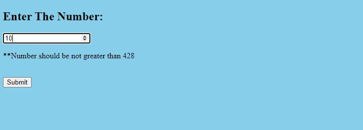
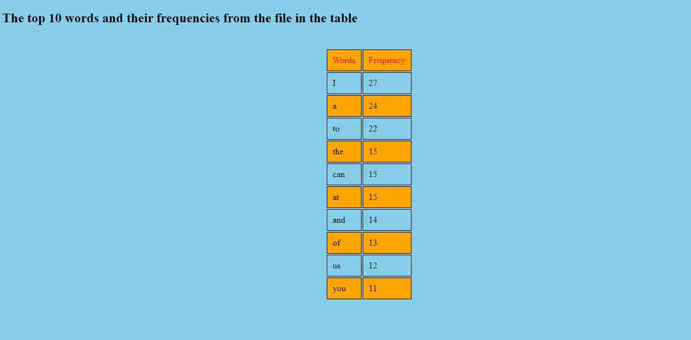

# Terribly-Tiny-Tales-Project-Test

I have hosted this project on pythonanwhere platform.
To see go to http://sat123.pythonanywhere.com/

* This web app project is made for Terribly Tiny Tales Onile Test round.
* Task:- 
   1. A front end which accepts a number input N with a Submit button.

   2. On entering a value and pressing submit, a request should be sent to the backend.

   3. From the backend, fetch a file hosted at http://terriblytinytales.com/test.txt

   4. From the backend, return the top N most frequently occurring words in this file (do not use a ready made module for frequency computation)

   5. Display the top N words and their frequency of occurrence in the frontend, in a tabular format.
* I have used Python flask web app framework to take user input and send to backend after that i fetch the txt file and 
  reding the file line by line and put it to in dictinory so that i can get the frequency of each words in the txt file. 
  After that I have Orederd the dictinory by its value so that i can get top words by their frqunecies.
* After that we have number (N) then I split the data by N numbers and return the render_template output html file 
  which will show the top N words with their frequencies in TABULAR format.

Few screenshots of the inputs from the website.

USER INPUT 5

User INPUT 10

User INPUT 50

