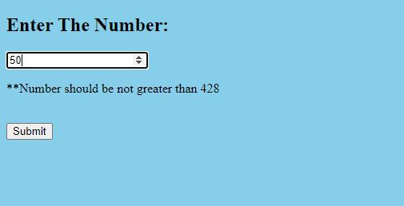

# Terribly-Tiny-Tales-Project-Test
# This web app project is made for Terribly Tiny Tales Onile Test Round.

## I have hosted this project on pythonanwhere platform. To see go to http://sat123.pythonanywhere.com/

## Task
   1. A front end which accepts a number input N with a Submit button.

   2. On entering a value and pressing submit, a request should be sent to the backend.

   3. From the backend, fetch a file hosted at http://terriblytinytales.com/test.txt

   4. From the backend, return the top N most frequently occurring words in this file (do not use a ready made module for frequency computation)

   5. Display the top N words and their frequency of occurrence in the frontend, in a tabular format.
 
## Installation required Dependicies
In this project we only need to install flask in our python environment from command promt-
  * pip install Flask
  
## Below are the steps and components of the code which i have used in this project.
There are two components in the project:
1. Backend (FILE: app.py)
2. Frontend (FILE: Home.html,Output.html) {all the html files should be in templates folder otherwise flask framework will not able to recognise it.}

### STEPS
** After sucessfully installing the package first we need to take user input from the front end and send to backend to do the backend work.
When we run the app file we got the local host link provided by flask framework then we return the render_template ( This is where one can take advantage of Jinja2 template engine, on which Flask is based. Instead of returning hardcode HTML from the function, a HTML file can be rendered by the render_template() function.) in which i have made Home.html file which have one placeholder box whuch takes the number as input and with post method it will send the number to the backend.

** second task is to fetch the txt file and count the frequency of each words in the given file. So what i did is:
- Read the file with open function.
- Make a empty dictinoary.
- Using for loop read the txt file line by line and split the line by words and update each words in dictinory with their count.
- In the end we have final dictionary but we need to do one more task we have to sort it in descending order so that we can get top frequency of wors on the top.
- I have used sorted function as an argument (object, key,reverse). This function sort the dictionary by it's value in descending order.

** Now we have user input in our backend ( we got 428 uniq words) so in the beginning i have check one the condition if user input is greater than 428 then it will show an error.
if user number is below 428 then suppose user enters 5 then I declare a list which will cut the dictionary to the Top N words and return this dictionary to render_template to Output.html file to show the Words and their frequencies in tabular form.

** Output.html In this html file which will show the words and their frequency in tabular form, I have send the top N index dictionary from the backend file and user input number.
Then I have created a table named(words and Frequencies) which will add more table in for loop as our words increase according to the user input.

### In the end we will get the desired Tabular Form data on our screen in the form of Top N words with their frequencies. 
  
## How to Run
Step 1: Make sure you have Python package flask.

Step 2: Go to this app's directory and run python app.py file.

## Few screenshots of the inputs from the website.

USER INPUT 5

User INPUT 10

User INPUT 50

# ThankYou!!!
